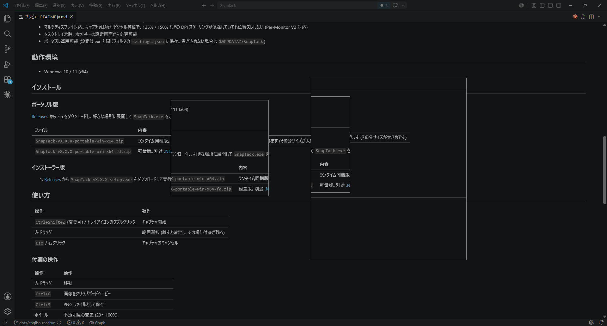

# SnapTack

[English](README.md) | **日本語**

[](https://github.com/yamahand/SnapTack/actions/workflows/ci.yml)

画面の任意の範囲をキャプチャして、そのまま「付箋」として画面に貼っておける Windows 用常駐ツールです。
SETUNA2(開発終了したフリーソフト)の後継を目指しています。

資料の一部・エラーメッセージ・参考画像などを一瞬で切り取って画面に貼り、見比べたり他アプリへコピーしたりできます。



## 特徴

- **Ctrl+Shift+Z** で画面がその瞬間の映像でフリーズ → ドラッグで範囲選択 → 選択範囲がその場に「付箋」として残る
- 付箋は常に最前面。ドラッグで移動、`Ctrl+C` でコピー、`Ctrl+S` で保存、中クリックで閉じる
- ホイールで不透明度を変更、ダブルクリックで小さなタイル (サイコロ) に畳んで場所を節約
- **PNG / JPEG / BMP で保存可能** (JPEG は品質を指定可)。**すぐ保存**ならダイアログを出さず、指定フォルダへ日時名で書き出す。保存したファイルパスのクリップボードへのコピーも設定できる
- **手元にある画像からも付箋を作れる** — トレイメニューまたは付箋上の `Ctrl+V` でクリップボードから貼り付け、あるいは画像ファイルをスクラップリストへドラッグ&ドロップ
- **貼った後に編集できる** — 25%〜400% の拡大縮小、回転、反転、不要な部分のトリム。**非破壊編集**なので「編集をリセット」でいつでも元に戻せます
- **スクラップリスト** — **Ctrl+Shift+L** で開くと、すべてのスクラップをサムネイル一覧で見渡せる。画面への表示 / 非表示、コピーや保存、閉じたものはゴミ箱から復元できる
- **再起動をまたいでスクラップを保持。** 貼り付け済みの付箋は次回起動時に同じ位置へ復元される。付箋を閉じても破棄せずゴミ箱へ移すため誤操作で失わない。ゴミ箱は指定日数の経過で自動削除される
- マルチディスプレイ対応。キャプチャは物理ピクセル等倍で、125% / 150% などの DPI スケーリングが混在していても位置ズレしない (Per-Monitor V2 対応)
- タスクトレイ常駐。ホットキー・保持数の上限・起動時復元は設定画面から変更可能
- 日本語 / 英語に対応。既定では Windows の表示言語に従い、設定画面から手動で切り替えも可能
- ポータブル運用可能 (設定は exe と同じフォルダの `settings.json`、スクラップは隣の `scraps/` フォルダに保存。書き込めない場合は `%APPDATA%\SnapTack`)

## 動作環境

- Windows 10 / 11 (x64)

## インストール

### ポータブル版

[Releases](../../releases) から zip をダウンロードし、好きな場所に展開して `SnapTack.exe` を起動するだけです。zip は 2 種類あります。

| ファイル | 内容 |
|---|---|
| `SnapTack-vX.X.X-portable-win-x64.zip` | **ランタイム同梱版。迷ったらこちら。** .NET が入っていない環境でもそのまま動きます (その分サイズが大きめです) |
| `SnapTack-vX.X.X-portable-win-x64-fd.zip` | 軽量版。別途 [.NET 10 Desktop Runtime](https://dotnet.microsoft.com/download/dotnet/10.0) のインストールが必要です |

### インストーラー版

1. [Releases](../../releases) から `SnapTack-vX.X.X-setup.exe` をダウンロードして実行

### 起動時に警告が出る場合

コード署名をしていないため、初回起動時に SmartScreen の「Windows によって PC が保護されました」が表示されます。
**詳細情報** → **実行** で起動できます。

## 使い方

| 操作 | 動作 |
|---|---|
| `Ctrl+Shift+Z` (変更可) / トレイアイコンのダブルクリック | キャプチャ開始 |
| 左ドラッグ | 範囲選択 (離すと確定し、その場に付箋が残る) |
| `Esc` / 右クリック | キャプチャのキャンセル |

### 付箋の操作

| 操作 | 動作 |
|---|---|
| 左ドラッグ | 移動 |
| `Ctrl+C` | 画像をクリップボードへコピー |
| `Ctrl+V` | クリップボードの画像を、この付箋から少しずらした位置に新しい付箋として貼る |
| `Ctrl+S` | ファイルとして保存 (ダイアログで PNG / JPEG / BMP を選択) |
| `Ctrl+Shift+S` | すぐ保存 (ダイアログ無しで指定フォルダへ) |
| ホイール | 不透明度の変更 (20〜100%) |
| `Alt+↑` / `Alt+↓` | 10% ずつ拡大 / 縮小 (25〜400%) |
| `Alt+Shift+↑` / `Alt+Shift+↓` | 1% ずつの微調整 |
| `R` / `Shift+R` | 右 / 左に 90° 回転 |
| `T` | トリム (ドラッグで範囲選択 → `Enter` で確定、`Esc` で取消) |
| `↑↓←→` / `Shift+↑↓←→` | 1px / 50px 移動 (移動中は座標を数値表示) |
| ダブルクリック | サイコロ化 (小さなタイルに畳む) / 元に戻す |
| 中クリック | 閉じる |
| 右クリック | メニュー (コピー / 貼り付け / 保存 / すぐ保存 / 拡大縮小 / 回転・反転 / トリム / 編集をリセット / 不透明度 / サイコロ化 / 閉じる / リストに隠す) |

付箋は何枚でも同時に貼れます。全部閉じてもアプリはトレイに常駐し続けます。終了はトレイメニューの「終了」から。

### 付箋の編集

拡大縮小・回転・反転・トリムは**非破壊編集**です。元画像を保持しているため、拡大と縮小を繰り返しても劣化せず、「編集をリセット」でいつでも元に戻せます。コピーと保存では**画面に見えているとおり**の編集後の画像が出力されます。編集内容は再起動後も保持されます。

編集していない付箋の見た目と挙動はこれまでどおりです (物理ピクセル等倍・拡大縮小なし)。

### スクラップリスト

**Ctrl+Shift+L** (変更可) またはトレイメニューからスクラップリストを開けます。すべてのスクラップをサムネイルで一覧でき、ゴミ箱は別タブになっています。

| 操作 | 動作 |
|---|---|
| ダブルクリック / `Enter` | 画面に表示して最前面へ持ってくる |
| `Ctrl+C` | 選択中のスクラップ画像をコピー |
| `Delete` | ゴミ箱へ移動 (ゴミ箱内なら確認のうえ完全削除) |
| 右クリック | メニュー (画面に表示 / 隠す / コピー / 保存 / すぐ保存 / ゴミ箱へ移動 — ゴミ箱内では復元 / 完全に削除) |

付箋を閉じると破棄せずゴミ箱へ移すため、中クリックの誤操作でも復元できます。スクラップとゴミ箱には保持数の上限があり (既定 200 件 / 50 件)、30 日を過ぎたゴミ箱は自動で削除されます。これら 3 つの上限と、起動時に付箋を復元するかどうかは設定画面から変更できます。

### キャプチャ以外からスクラップを作る

キャプチャしなくてもスクラップを作れます。

| 方法 | 場所 |
|---|---|
| **クリップボードから貼り付け** | トレイメニュー、または付箋にフォーカスがある状態で `Ctrl+V` |
| **ドラッグ&ドロップ** | スクラップリストウィンドウの好きな場所へ画像ファイルをドロップ |

貼り付けは、コピーされた画像・コピーされたファイル・画像ファイルのパスを表すテキストのいずれにも対応します。対応形式は PNG / JPEG / BMP / GIF / TIFF に加え、対応コーデックが入っていれば WebP / AVIF も読み込めます (Windows 11 には標準で付属しますが削除可能です。コーデックが無い場合は読み飛ばすだけで、エラーにはなりません)。

## ビルド方法

.NET 10 SDK が必要です。

```powershell
dotnet build SnapTack.slnx

# ポータブル版 (single-file) の作成
# ランタイム同梱版と軽量版の zip が artifacts/ に 2 つ出力される
pwsh scripts/publish.ps1

# インストーラーの作成 (Inno Setup 6 が必要。publish 実行後に)
# artifacts/publish (ランタイム同梱版) の exe を取り込む
iscc installer\SnapTack.iss
```

バージョン番号は `Directory.Build.props` の 1 箇所だけで定義しています。
上記コマンドはその値を使います。リリース時は Git タグが正となり、CI から各所へ渡されます。

```powershell
# テストの実行
dotnet test SnapTack.slnx
```

### リリース手順

リリースは自動化されています。`v*` タグを push するとポータブル版 2 種とインストーラーがビルドされ、
**ドラフト**の GitHub Release に添付されます。

```powershell
# 1. Directory.Build.props の <Version> を更新してコミットする
# 2. タグを打って push する (これがリリースワークフローの起動条件)
git tag v1.4.0
git push origin v1.4.0
```

その後 [Releases](../../releases) を開き、添付ファイルを確認してリリースノートを書き、
ドラフトを手動で公開します。

### 開発ドキュメント

仕様・マイルストーン・CI 方針は [docs/](docs/README.md) にあります。

## ライセンス

[MIT License](LICENSE)

SETUNA2 にインスパイアされた独立実装であり、オリジナルのコードは含みません。
