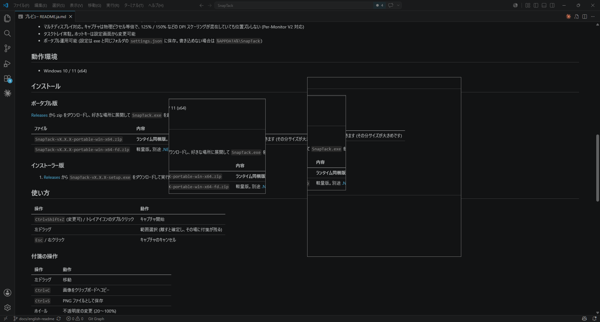

# SnapTack

**English** | [日本語](README.ja.md)

[](https://github.com/yamahand/SnapTack/actions/workflows/ci.yml)

A Windows tray utility that captures any region of your screen and pins it to the desktop as a sticky note.
It aims to be a successor to SETUNA2, a freeware tool that is no longer developed.

Clip part of a document, an error message, or a reference image in an instant, pin it to your screen, and keep it there to compare against or copy into another app.



## Features

- Press **Ctrl+Shift+Z** to freeze the screen, drag to select a region, and the selection stays on your desktop as a sticky note
- Notes are always on top. Drag to move, `Ctrl+C` to copy, `Ctrl+S` to save as PNG, middle-click to close
- Scroll the mouse wheel to change opacity, double-click to fold a note into a small tile to save space
- Multi-monitor support. Captures at 1:1 physical pixels, with no positional drift even across mixed DPI scaling such as 125% / 150% (Per-Monitor V2 aware)
- Lives in the system tray. The hotkey can be changed from the settings window
- Runs portably — settings are saved to `settings.json` next to the executable, falling back to `%APPDATA%\SnapTack` if that location isn't writable

## Requirements

- Windows 10 / 11 (x64)

## Installation

### Portable

Download a zip from [Releases](../../releases), extract it anywhere, and run `SnapTack.exe`. Two builds are available:

| File | Description |
|---|---|
| `SnapTack-vX.X.X-portable-win-x64.zip` | **Runtime included. Pick this one if you're unsure.** Runs as-is even without .NET installed (larger download) |
| `SnapTack-vX.X.X-portable-win-x64-fd.zip` | Lightweight build. Requires [.NET 10 Desktop Runtime](https://dotnet.microsoft.com/download/dotnet/10.0) to be installed separately |

### Installer

Download `SnapTack-vX.X.X-setup.exe` from [Releases](../../releases) and run it.

### If Windows blocks the app

The binaries are not code-signed, so SmartScreen shows a "Windows protected your PC" dialog the first time you run them.
Click **More info** and then **Run anyway** to start the app.

## Usage

| Action | Result |
|---|---|
| `Ctrl+Shift+Z` (configurable) / double-click the tray icon | Start a capture |
| Left-drag | Select a region (releasing confirms it and leaves a note in place) |
| `Esc` / right-click | Cancel the capture |

### Working with notes

| Action | Result |
|---|---|
| Left-drag | Move |
| `Ctrl+C` | Copy the image to the clipboard |
| `Ctrl+S` | Save as a PNG file |
| Mouse wheel | Change opacity (20–100%) |
| Double-click | Fold into a tile / restore |
| Middle-click | Close |
| Right-click | Menu (copy / save as PNG / opacity / fold / close) |

You can pin as many notes as you like at once. Closing them all leaves the app running in the tray — quit from the tray menu's "終了" (Exit).

## Building

Requires the .NET 10 SDK.

```powershell
dotnet build SnapTack.slnx

# Build the portable releases (single-file)
# Outputs two zips to artifacts/: runtime-included and lightweight
pwsh scripts/publish.ps1

# Build the installer (requires Inno Setup 6; run after publish)
# Picks up the executable from artifacts/publish (the runtime-included build)
iscc installer\SnapTack.iss
```

The version number is defined once, in `Directory.Build.props`. The commands above use that
value; for a release the Git tag takes precedence and is passed in by CI.

```powershell
# Run the tests
dotnet test SnapTack.slnx
```

### Releasing

Releases are automated. Pushing a `v*` tag builds both portable zips and the installer,
and attaches them to a **draft** GitHub Release:

```powershell
# 1. Bump <Version> in Directory.Build.props, then commit it
# 2. Tag and push — this is what triggers the release workflow
git tag v1.4.0
git push origin v1.4.0
```

Then open [Releases](../../releases), check the attached files, write the release notes,
and publish the draft manually.

## License

[MIT License](LICENSE)

An independent implementation inspired by SETUNA2; it contains none of the original code.
